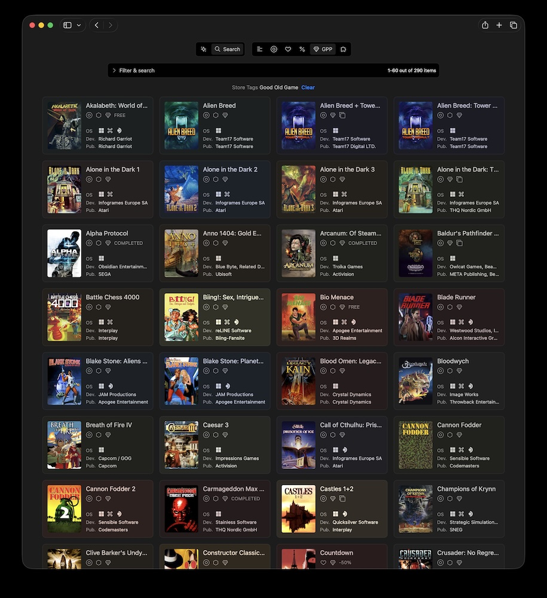
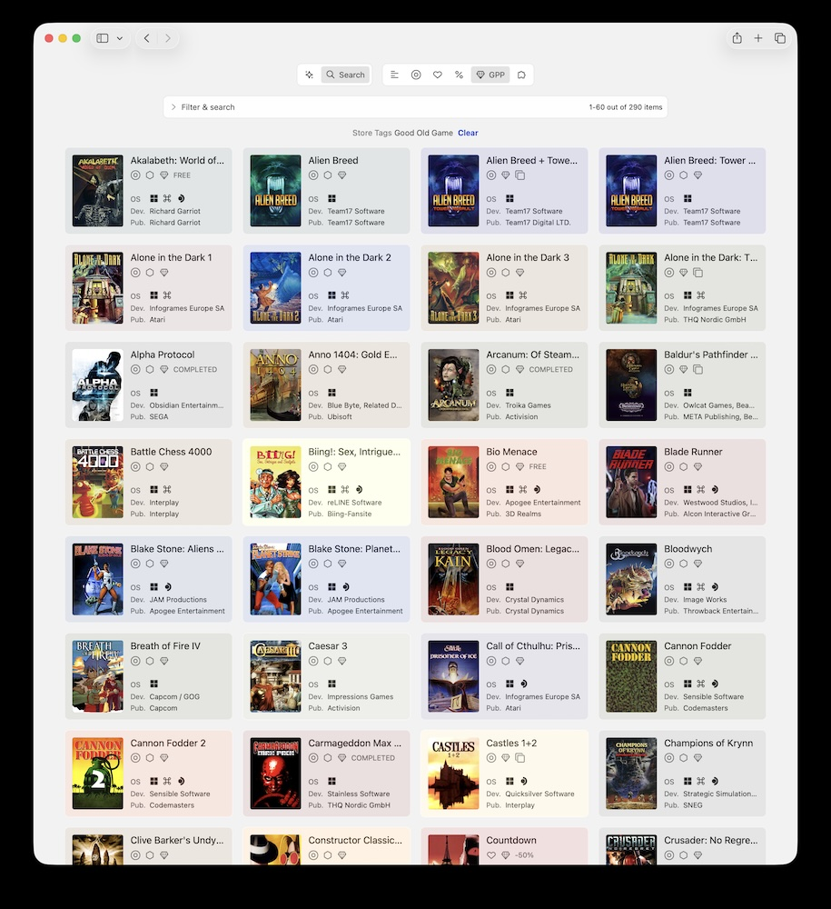

# vangogh

Backend microservice to sync and serve metadata, images from GOG.com. Can be used as a CLI app or a web service that provides a frontend to browse, search that data.

| Dark theme                                       | Light theme                                        |
|--------------------------------------------------|----------------------------------------------------|
|        |        |
|  |  |


## Installation

The recommended way to install `vangogh` is with docker-compose:

- create a `docker-compose.yaml` file (this minimal example omits common settings like network, restart, etc):
- NOTE: cold storage signifies resources used less frequently
- NOTE: hot storage signifies resources used on most page loads

```yaml
version: '3'
services:
  vangogh:
    container_name: vangogh
    image: ghcr.io/arelate/vangogh:latest
    environment:
    # Download lists filters
    # - VANGOGH_OS=Windows,macOS
    # - VANGOGH_LANG-CODE=en,fr
    # - VANGOGH_NO-PATCHES=true
    # debug
    # - VANGOGH_SYNC_DEBUG=true    
    volumes:
      # cold storage is less frequently accessed data,
      # that can be stored on hibernating HDD.
      # hot storage is frequently accessed data,
      # that can benefit from being stored on SSD.
      # backups (cold storage)
      - /docker/vangogh/backups:/var/lib/vangogh/backups
      # downloads (cold storage)
      - /docker/vangogh/downloads:/var/lib/vangogh/downloads
      # checksums (hot storage)
      - /docker/vangogh/checksums:/var/lib/vangogh/checksums
      # images (hot storage)
      - /docker/vangogh/images:/var/lib/vangogh/images
      # input (hot storage)
      - /docker/vangogh:/var/lib/vangogh/input
      # description_images (hot storage)
      - /docker/vangogh/description_images:/var/lib/vangogh/description_images
      # logs (cold storage)
      - /docker/vangogh/logs:/var/lib/vangogh/logs
      # metadata (hot storage)
      - /docker/vangogh/metadata:/var/lib/vangogh/metadata
      # output (hot storage)
      - /docker/vangogh:/var/lib/vangogh/output
      # recycle_bin (cold storage)
      - /docker/vangogh/recycle_bin:/var/lib/vangogh/recycle_bin
      # sharing timezone from the host
      - /etc/localtime:/etc/localtime:ro
      # certificates
      - /etc/ssl/certs/ca-certificates.crt:/etc/ssl/certs/ca-certificates.crt:ro
    ports:
      # https://en.wikipedia.org/wiki/Vincent_van_Gogh
      - "1853:1853"
```
- (move it to location of your choice, e.g. `/docker/vangogh` or remote server or anywhere else)
- while in the directory with that config - pull the image with `docker-compose pull`
- start the service with `docker-compose up -d`

## Getting started

After you've installed `vangogh`, you need to authenticate your GOG.com username / password. 
Please note - your credentials are not stored by `vangogh` and only used to get session cookies from GOG.com - 
exactly the same way you would log in to a website.

To do that you'll need to import your cookies from existing browser session. To do that you need to create `cookies.txt` in the `temporary data` folder (see [docker installation](#Installation)),
   then follow [instructions here](https://github.com/boggydigital/coost#copying-session-cookies-from-an-existing-browser-session) to copy `gog.com` cookies into that file. When you run `vangogh` for the first time, it'll import the cookie header value and split individual parameters.

Regardless of how you do it, the content of `cookies.txt` should look like this:

```text
gog.com
 cart_token=(some value)
 gog-al=(some value)
 gog_lc=(some value)
 gog_us=(some value)
```

You can verify that you've successfully authorized `vangogh` by getting licences data (a list of all product ids that GOG.com considers owned by you): `docker-compose exec vangogh vg get-data licences`. The successful run will display something like this:

```text
vangogh is serving your DRM-free needs 
getting licences (game) data... 
 fetching licences (game)... done 
 splitting licences (game)... 
 splitting licences (game)... unchanged 
```

If you want to de-authorize `vangogh` from accessing your GOG.com data - delete the `cookies.txt` file. After that you'll still be able to download anything that does not require account authorization. All the account specific data you'll have accumulated until that point will be preserved. 

## Serving data

The recommended way to enjoy the data sync'd by `vangogh` is to serve it with a `serve` command.

## Updating data

To update your data you can use `vangogh` with a CLI interface to get and maintain all the publicly available GOG.com data, including your account data (game installers):

- in the same folder with `docker-compose.yaml` config use `docker-compose exec vangogh vg <command> <options>`
- most commonly you would run sync `docker-compose exec vangogh vg sync -all` that gets all available data from GOG.com. Sync is optimized to get as little data as possible on each run - only the newly added images and updated installers. There is no great way to determine if metadata was updated remotely, so all of it is fetched on each sync - however upon doing that `vangogh` would know exactly what changed and use this information to optimize decisions.

### Disk space requirements

Please note that all data === a lot of data, so make sure you have space available or use specific options to get what you need (any combination of `-data -images -screenshots -thumbnails -downloads`)

Here are few estimates of how much space you'll need for each type of data:

- core metadata (Store, Account, Wishlist products and associated detailed data; Steam reviews, product pages, app list): 1.3Gb
- images, including screenshots: 30Gb
- description items: 6.5Gb
- thumbnails: 400 Mb
- checksums (automatically downloaded with installers for validation): 120Mb
- product installers: estimate is about 6.5Tb for 1000 products for installers for the 10 most common languages for all operating systems (just Windows and English is about half of that)

## Taking care of your data

Syncing data keeps it in sync with GOG.com. As part of this process some data is left on the system and `vangogh` provides few ways to clean up and vet the data:

- `cleanup` will take care of older downloads versions. `cleanup -all -test` will enumerate all installers that are not linked to most current data. `cleanup -all` (without `-test`) will move that stale data to `recycle_bin` under your state directory
- `vet` will take care of various data problems, such as metadata that was downloaded earlier, and is not longer available at GOG.com. `vet -all` will run series of tests of data and print out recommendations. `vet -all -fix` will also attempt to repair the data.
- `validate` will test installers you've downloaded using validation files provided by GOG.com. `validate -all` will do that for all installers (a very long process if you have a lot of them!). Please note that GOG.com is missing validation files for some installers and this will not be considered a critical error. 

## Sharing games

`vangogh` assumes you follow GOG.com [games sharing guidelines](https://support.gog.com/hc/en-us/articles/212184489-Can-I-share-games-with-others-?product=gog). Just like GOG.com, we trust you that this will not be abused.
